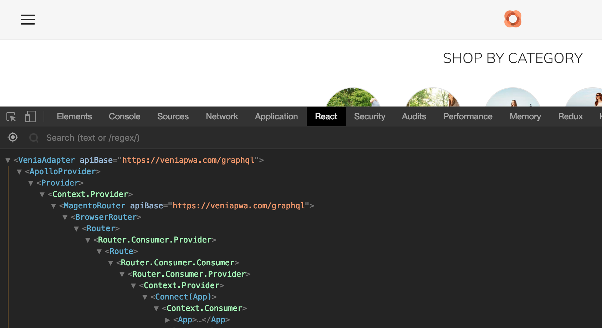

# Routing in PWA Studio
Routing in PWA studio is complex, it needs to consider all the different types of routes from Magento (category, product, CMS, customer, sales etc) as well as all the URL rewrites which Magento offers. This article aims to walk through how routing works in PWA Studio to help you gain a better understanding of it.

## Server Side Routing
The Venia storefront use a the [Upward] server middleware from PWA Studio to proxy requests from the user's client.  It allows you to configure how requests are proxied with the [./upward.yml] &/or [venia-ui/upward.yml] files.  

Upward pre-renders the [application shell] with mustache templates found in the [./templates/] directory and sends them to the client. To get a better idea of how PWA Studio's Upward server works, it's recommend to complete the [Hello UPWARD Tutorial] from Magento.

## React Routing
Once the client loads the first web page all other requests are handled by the React App like any other Single Page App. It re-renders its content in response to navigation actions (e.g. clicking a link) without making a request to the server to fetch new HTML and without refreshing my page.

To see how the Venia storefront handles routing, first lets look in the entry point of the app in [packages/venia-concept/src/index.js].
What React component is it rendering? [`<App />`].  
Check at the top of the file to see where this component is coming from from, [at line 8].

Note the use of the `<ApolloContext.Provide />` [HOC] wrapped around the the `<App />` component. This is where Venia sets the ApolloProvider, the ReduxStore, and the [Router configuration].  See [venia-ui/lib/drivers/adapter.js#L85].  Install the [react-developer-tools] extension for chrome and use it to inspect the React front end of venia.magento.com.

The [APP component] is responsible for rendering the components for the [application shell].
The [`<Main>`] component here is using the **renderRoutes()** function from [renderRoutes.js].

In [renderRoutes.js] we see how pwa-studio is using [react-router] for rendering static routes like _/search.html_ and _/create-account_. It's using the `<Page>` component from PWA Studio's Peregrine library to render Magento's Category & Product routes.

If we look a little closer we can see that the [Page component] in turn uses the [MagentoRouteHandler component] to resolve the route by querying Magento 2 API, it then receives the page type in the response. Currently, those page types are: **CMS_PAGE**, **CATEGORY** and **PRODUCT**.

If the URL doesn’t exist, Magento 2 will send out a 404 error (temporary until proper 404 page type has been implemented). If the URL exists, MagentoRouter will render a **RootComponent** which is assigned to the received page type.

All Root Component folders must be placed in the `rootComponentsDirs`, depending on your version of PWA Studio the **src/RootComponents/** directory is defined in:
- [pwa-buildpack/lib/WebpackTools/plugins/RootComponentsPlugin.js#L71]
- [pwa-buildpack/lib/WebpackTools/configureWebpack.js#L186-L190]
- [pwa-buildpack/lib/Utilities/getClientConfig.js#L127-L132]

In this directory you will find it's components each have an _index.js_ entry point.  
These files are important as webpack uses the commented section to define the pageType for a specific page type. See [src/RootComponents/Category/index.js].  

> As you can see, the commented section in index.js defines the RootComponent for a specific page type. If we change pageTypes variable value to PRODUCT (webpack restart is required to perform code-splitting again), this component will be used for Product page, and not for CMS page as specified previously.
>
> ref: https://inchoo.net/magento-2/magento-pwa-studio-routing-root-components/

Since Magento's GraphQL is still in development, page types are limited:
- [CatalogUrlRewriteGraphQl schema]
- [CmsUrlRewriteGraphQl schema]

#### References
- [Routing with PWA Studio]
- [Magento PWA Studio: Routing and Root Components]

---
- [> see other topics](../../README.md#Topics)

[packages/venia-concept/src/index.js]: https://github.com/magento-research/pwa-studio/blob/v4.0.0/packages/venia-concept/src/index.js
[`<App />`]: https://github.com/magento/pwa-studio/blob/v4.0.0/packages/venia-concept/src/index.js#L40
[at line 8]: https://github.com/magento-research/pwa-studio/blob/v4.0.0/packages/venia-concept/src/index.js#L8: 
[HOC]: https://reactjs.org/docs/higher-order-components.html
[Router configuration]: https://magento.github.io/pwa-studio/peregrine/routing/#magentorouter
[venia-ui/lib/drivers/adapter.js#L85]: https://github.com/magento/pwa-studio/blob/v4.0.0/packages/venia-ui/lib/drivers/adapter.js#L85
[react-developer-tools]: https://chrome.google.com/webstore/detail/react-developer-tools/fmkadmapgofadopljbjfkapdkoienihi
[APP component]: https://github.com/magento/pwa-studio/blob/develop/packages/venia-ui/lib/components/App/app.js
[application shell]: https://magento.github.io/pwa-studio/technologies/basic-concepts/app-shell/
[`<Main>`]: https://github.com/magento/pwa-studio/blob/v4.0.0/packages/venia-ui/lib/components/App/app.js#L127-L133
[renderRoutes.js]: https://github.com/magento/pwa-studio/blob/develop/packages/venia-ui/lib/components/App/renderRoutes.js
[react-router]: https://reacttraining.com/react-router/web/guides/quick-start
[Page component]: https://github.com/magento/pwa-studio/blob/develop/packages/peregrine/lib/Page/page.js
[MagentoRouteHandler component]: https://github.com/magento/pwa-studio/blob/develop/packages/peregrine/lib/Router/magentoRouteHandler.js
[pwa-buildpack/lib/WebpackTools/plugins/RootComponentsPlugin.js#L71]: https://github.com/magento/pwa-studio/blob/develop/packages/pwa-buildpack/lib/WebpackTools/plugins/RootComponentsPlugin.js#L71
[pwa-buildpack/lib/WebpackTools/configureWebpack.js#L186-L190]: https://github.com/magento/pwa-studio/blob/v4.0.0/packages/pwa-buildpack/lib/WebpackTools/configureWebpack.js#L186-L190
[pwa-buildpack/lib/Utilities/getClientConfig.js#L127-L132]: https://github.com/magento/pwa-studio/blob/develop/packages/pwa-buildpack/lib/Utilities/getClientConfig.js#L127-L132
[src/RootComponents/Category/index.js]: https://github.com/magento/pwa-studio/blob/develop/packages/venia-ui/lib/RootComponents/Category/index.js
[CatalogUrlRewriteGraphQl schema]: https://github.com/magento/magento2/blob/2.3.3/app/code/Magento/CatalogUrlRewriteGraphQl/etc/schema.graphqls#L20-L23
[CmsUrlRewriteGraphQl schema]: https://github.com/magento/magento2/blob/2.3.3/app/code/Magento/CmsUrlRewriteGraphQl/etc/schema.graphqls#L4-L6
[Routing with PWA Studio]: https://magento.github.io/pwa-studio/peregrine/routing/
[Magento PWA Studio: Routing and Root Components]: https://inchoo.net/magento-2/magento-pwa-studio-routing-root-components/
[Upward]: https://magento.github.io/pwa-studio/technologies/upward/
[./upward.yml]: https://github.com/magento/pwa-studio/blob/develop/packages/venia-concept/upward.yml
[venia-ui/upward.yml]: https://github.com/magento/pwa-studio/blob/develop/packages/venia-ui/upward.yml
[application shell]: https://magento.github.io/pwa-studio/technologies/basic-concepts/app-shell/
[./templates/]: https://github.com/magento/pwa-studio/tree/develop/packages/venia-ui/templates
[Hello UPWARD Tutorial]: https://magento.github.io/pwa-studio/tutorials/hello-upward/simple-server/