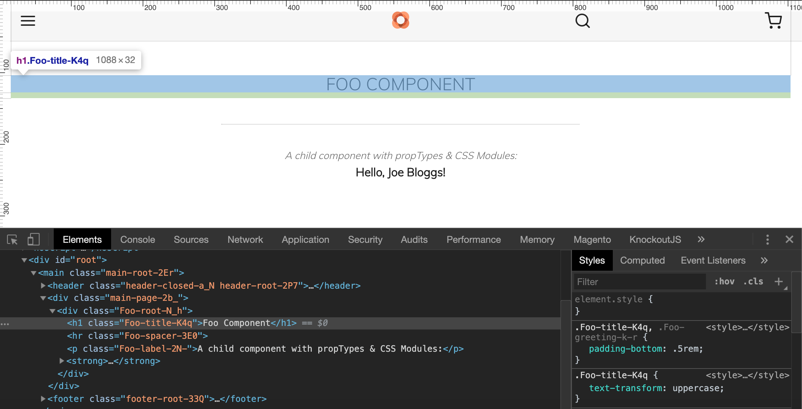

# CSS Modules
PWA Studio uses [CSS Modules] to scope styles to a component without side effects on other parts of the web app.   
To use them start by adding the following CSS file:

_[/src/components/Foo/Foo.css]_
```css
.root {
    padding: 3rem 1rem 1rem;
    text-align: center;
}
 
.title {
    text-transform: uppercase;
}
 
.title,
.greeting {
    padding-bottom: .5rem;
}
 
.spacer {
    max-width: 500px;
    border-color: #ddd;
    border-top: 0;
    margin: 36px auto;
}
 
.label {
    color: #666;
    padding-bottom: 8px;
    font-style: italic;
    font-size: 14px;
}
```

Import the PWA studio's mergeClasses component and the CSS classes from the above _Foo.css_ into the Foo component:    
```javascript
import { mergeClasses } from '@magento/venia-ui/lib/classify';
import defaultClasses from './Foo.css';
```

Assign the class names fromm the css file you imported:    
```javascript
const classes = mergeClasses(defaultClasses);
```

The CSS class names can now be added to the JSX with something like:

```javascript
return (
  <div className={classes.root}>
    <h1 className={classes.title}>Foo Component</h1>
    <hr className={classes.spacer} />
    <p className={classes.label}>A child component with propTypes &amp; CSS Modules:</p>
    <Greeting name="Joe Bloggs" className={classes.title} />
  </div>
);
```

Inspect the `h1.title` element in the browser inspector to see how the CSS class name is scoped to the element.



---
- [> see other topics](../../README.md#Topics)

[CSS Modules]: https://magento.github.io/pwa-studio/technologies/basic-concepts/css-modules/
[HOC]: https://reactjs.org/docs/higher-order-components.html
[es6's destructuring]: https://developer.mozilla.org/en-US/docs/Web/JavaScript/Reference/Operators/Destructuring_assignment
[/src/components/Foo/Foo.css]: /src/components/Foo/Foo.css
