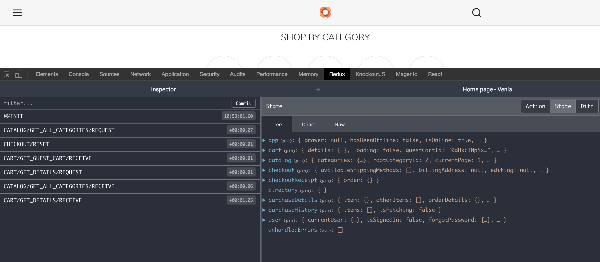

# Manage State with Redux

PWA Studio's Venia storefront uses [Redux] to manage the application state. If you're not familiar with Redux you should do some research online so you have basic understanding of it.  

_Note: Recent versions of PWA Studio now also use React Hooks to manage state._

### Introduction
First lets look at how PWA Studio uses Redux by installing the [Redux DevTools] extension for Chrome.  Once you have it installed, browse to the [Venia storefront] and explore what it has in it's Redux Store.


Next explore the following files & directories in the venia-concept package and look up their description in the [docs].

1. [src/index.js](https://github.com/magento/pwa-studio/blob/develop/packages/venia-concept/src/index.js#L7-L8)
2. [src/store.js](https://github.com/magento/pwa-studio/blob/develop/packages/venia-concept/src/store.js)
3. [src/reducers](https://github.com/magento/pwa-studio/tree/develop/packages/peregrine/lib/store/reducers)
4. [src/actions](https://github.com/magento/pwa-studio/tree/develop/packages/peregrine/lib/store/actions)
5. [src/middleware](https://github.com/magento/pwa-studio/tree/develop/packages/peregrine/lib/store/middleware)

### Add to The Redux Store
Create the following file...

_[/src/reducers/foo.js]_
```javascript
import { handleActions } from 'redux-actions';

import actions from '@magento/peregrine/lib/store/actions/app'; // we'll use these actions for now, and create our own one later

export const name = 'foo';

const initialState = {
  test: 'lorem ipsum'
};

const reducerMap = {
  [actions.toggleDrawer]: (state, { payload }) => {
    return {
      ...state,
      test: payload
    };
  }
};

export default handleActions(reducerMap, initialState);
```

Pay note of [handleActions] which replaces the traditional [switch statement] often used in Reducers.

Next Create the following file...

_[/src/reducers/index.js]_
```javascript
import foo from './foo';

const reducers = {
  foo
};

export default reducers;
```

Next in your applications [/src/store.js] update the `import` statements to include your local _reducers_ and combine them with the _reducers_ from @magento/peregrine:
```javascript
import { combineReducers, createStore } from 'redux';
import { enhancer, reducers as peregrineReducers } from '@magento/peregrine';
import localReducers from './reducers';

const rootReducer = combineReducers({ ...peregrineReducers, ...localReducers });

export default createStore(rootReducer, enhancer);
```

Now check to the  storefront and you should be able to see foo.test added to the Redux State, open & close the navigation menu and it should update.


### Get from the Redux Store
We'll display the foo.test value we set in the Redux store in the Foo component we created earlier.  

Open the [/src/components/Foo/Foo.js] file and add the following import.

```javascript
import { connect } from 'react-redux';
```

Now replace the export statement with the following:
```javascript
const mapStateToProps = ({ foo }) => ({ foo });
export default connect(mapStateToProps)(classify(defaultClasses)(Foo));
```

And add the following to your JSX:
```jsx
const mapStateToProps = ({ foo }) => ({ foo });
export default connect(mapStateToProps)(Foo);
```

Browse to _/foo.html_ to see _"lorem ipsum"_ you have added to the redux store.

### Update The Redux Store

#### Created an Action
To update the Redux store we first need to add a [redux action].

Add the following files...

_[/src/actions/foo/actions.js]_
```javascript
import { createActions } from 'redux-actions';
 
const prefix = 'FOO';
const actionTypes = [
    'UPDATE_TEST'
];
 
export default createActions(...actionTypes, { prefix });
```

_[src/actions/foo/asyncActions.js]_
```javascript
import actions from './actions';
 
export const updateTest = value => async dispatch =>
    dispatch(actions.updateTest(value));
```

_[src/actions/foo/index.js]_
```javascript
export { default } from './actions';
export * from './asyncActions';
```

**NOTE:** PWA Studio's Venia uses:

- [createActions] to create multiple actions at once.
- [async actions] which are useful when API responses update the redux store.

#### Update the Reducer with the New Action
Now that we have our redux action created add it to our reducer, go to _[/src/reducers/foo.js]_ and change the `import actions` statement to:     
```javascript
import actions from 'src/actions/foo';
```

And in the `reducerMap` change `actions.toggleDrawer` to `actions.updateTest`.

#### Create a component to update the Redux Store

Next we'll create a new child component which will use the action above to update the redux store.

_src/components/Foo/updateRedux.js_
```javascript
import React, { Component } from 'react';
import { connect } from 'react-redux';
import { compose } from 'redux';
import { PropTypes, func, string } from 'prop-types';
import { updateTest } from 'src/actions/foo';

class updateRedux extends Component {
  static propTypes = {
    test: PropTypes.string,
    updateTest: PropTypes.func.isRequired
  };

  render() {
    const { test, updateTest } = this.props;

    return (
      <input type="text" value={test} onChange={updateTest} style={{ textAlign: 'center' }} />
    );
  }
}

const mapDispatchToProps = dispatch => ({
  updateTest: (e) => dispatch(updateTest(e.target.value))
});

export default compose(
  connect(
    null,
    mapDispatchToProps
  )
)(updateRedux);
```

Import the above component to the FOO Component.  
```javascript   
import UpdateRedux from './updateRedux';
```

And add it to the JSX:    
```jsx
<hr className={classes.spacer} />
<p className={classes.label}>The input below is interacting with Redux:</p>
<UpdateRedux test={this.props.foo.test} />
<p style={{ marginTop: 10 }}>{this.props.foo.test}</p>
```

Now test it by typing into the new input box while checking Redux dev tools to see the value in the Redux store update.


---
- [> see other topics](../../README.md#Topics)

[Redux]: https://redux.js.org/
[Redux DevTools]: https://chrome.google.com/webstore/detail/redux-devtools/lmhkpmbekcpmknklioeibfkpmmfibljd
[Venia storefront]: https://veniapwa.com/
[docs]: https://magento.github.io/pwa-studio/venia-pwa-concept/project-structure/
[handleActions]: https://redux-actions.js.org/api/handleaction
[switch statement]: https://redux.js.org/basics/reducers#handling-more-actions
[redux action]: https://redux.js.org/basics/actions
[createActions]: https://redux-actions.js.org/api/createaction
[async actions]: https://redux.js.org/advanced/async-actions#async-actions
[/src/store.js]: /src/store.js
[/src/reducers/foo.js]: /src/reducers/foo.js
[/src/reducers/index.js]: /src/reducers/index.js
[/src/actions/foo/actions.js]: /src/actions/foo/actions.js
[src/actions/foo/asyncActions.js]: [src/actions/foo/asyncActions.js
[src/actions/foo/index.js]: [src/actions/foo/index.js
[/src/components/Foo/Foo.js]: /src/components/Foo/Foo.js