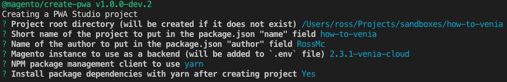
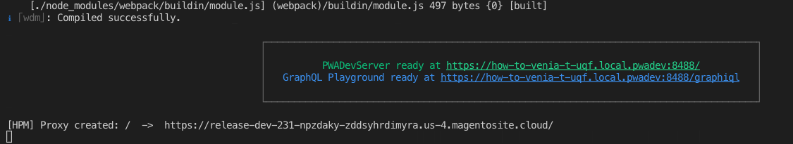

# Project Set-Up
This project is based on PWA Studio v4.  Please ensure you have the correct [stack prerequisites] installed locally before continuing.

### 1. Install
Simply start by running the below NPM command.
```bash
npm init @magento/pwa@cdmuc19
```

Answers the questions from the `npm init @magento/pwa` command.


_Please Note: the `npm init @magento/pwa@cdmuc19` command is currently a prototype from Magento._
_Magento are yet to release this command officially._

### 2. Add custom hostname and SSL cert
For the best PWA development experience, create a custom domain for by running:
```bash
yarn buildpack create-custom-origin ./
```

### 4. Start the App
Start your new PWA Studio project in developer mode.
```bash
yarn watch
```

This command should compile the assets, start a dev server and output the URL to use to view the application in your browser.



#### OPTIONAL Update Environment Variables 
You can continue to use the public Magento 2.3.1 backend & braintree credentials set in [.env] or you can update them to use your own by changing the properties for `MAGENTO_BACKEND_URL` and `BRAINTREE_TOKEN`.

See the PWA Studio docs on [Choosing the Magento 2.3 backend] for more details.

---
- [> see other topics](../../README.md#Topics)

[stack prerequisites]: https://magento.github.io/pwa-studio/venia-pwa-concept/setup/#prerequisites
[copy-venia-storefront doc]: ./copy-venia-storefront.md
[package.json]: ../../package.json#L2
[.env]: ../../.env.example
[Choosing the Magento 2.3 backend]: https://magento.github.io/pwa-studio/venia-pwa-concept/setup/#choosing-the-magento-23-backend