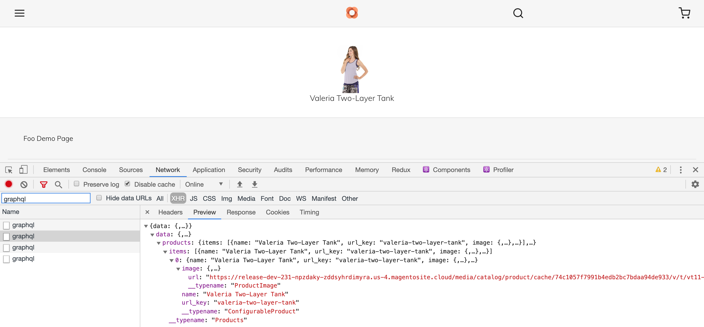

# Use Magento's GraphQL API with Apollo
PWA Studio's Venia storefront uses Apollo Queries to fetch data. If you're not familiar with [React Apollo] do some research online so you have basic understanding of it.    

Create the below file:

_src/queries/getProductData.graphql_
```graphql
query GetProductData($sku: String!) {
  products (filter: {sku: {eq: $sku}}){
    items {
      name,
      url_key,
    	image {
    	  url
    	}
    }
  }
}
```

Create a new child component:

_src/components/Foo/productLink.js_
```javascript
import React, { Component } from 'react';
import { Link } from '@magento/venia-ui/lib/drivers';

import { Query } from '../../drivers';  // this component is originally from react-apollo
import productDataQuery from '../../queries/getProductData.graphql';  // import the query you created above

class productInfo extends Component {
  render() {
    return (
      <Query query={productDataQuery} variables={{ sku: this.props.sku }} >
        {({ loading, error, data }) => {
          if (error) {
            return (
              <div>
                Data Fetch Error: <pre>{error.message}</pre>
              </div>
            );
          }
          if (loading) {
            return <div>loading...</div>;
          }

          return (
            <div>
              <Link to={"/" + data.products.items[0].url_key + ".html"}>
                <br />
                {data.products.items[0].name}
              </Link>
            </div>
          );
        }
        }
      </Query >
    );
  }
}

export default productInfo;
```

Add the `<ProductLink sku="VT11"/>` component to the JSX section of the Foo component. _Don't forget to import it!_

Browse to the /foo.html URL in the application.

Note that you can check the _graphql_ query in the browsers network tab.


Finally, import the loadingIndicator Venia component to productLink.js:
```javascript
import LoadingIndicator from '@magento/venia-ui/lib/components/LoadingIndicator';
```

And replace:
```jsx
<div>loading...</div>
``` 
with:
```jsx
<LoadingIndicator>{`Fetching Product...`}</LoadingIndicator>
```

Browse to the /foo.html URL in the application.

---
- [> see other topics](../../README.md#Topics)

[React Apollo]: https://github.com/apollographql/react-apollo